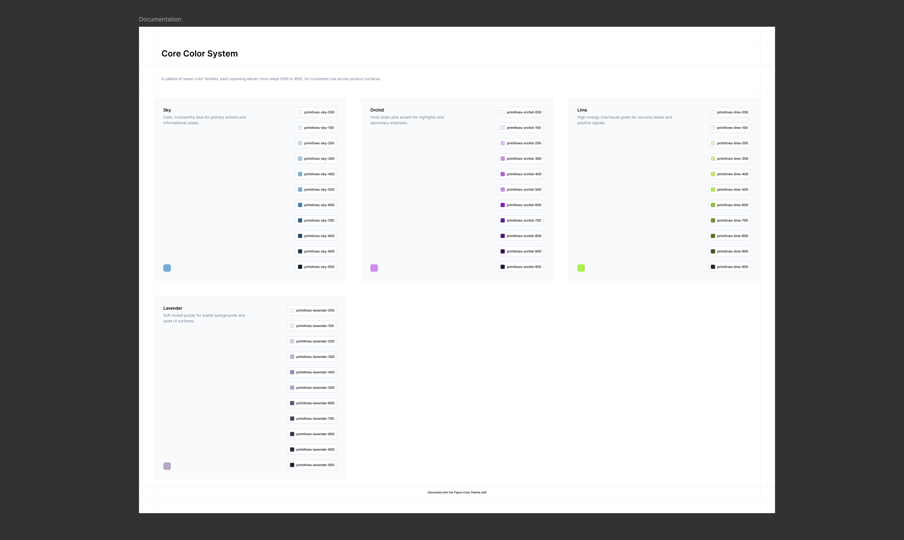

# Figma Color Palette

A Claude skill that generates a complete, ready-to-use color palette directly inside a Figma file — from a single base hex or a full list of colors.

One prompt in, and you get: Figma **variables** (color + string), a reusable **`Color Tag`** component, and a documented, auto-laid-out **`Color Section`** — all wired together so renaming or recoloring later never touches a hardcoded value.



## What it generates

- **Variables** — an 11-step tonal scale (`050` → `950`) per color, computed from your base hex via HSL, stored as bound Figma variables (never a hardcoded hex)
- **`Color Tag` component** — a reusable swatch + label badge, created from scratch on first use if your file doesn't have one yet
- **`Color Section`** — a documented block per palette (title, description, primary swatch, full tonal scale), auto-assembled into a page-level `Documentation` frame with a wrapping 3-column grid


## Why

Design system color scales are tedious to build by hand and easy to get subtly wrong — inconsistent lightness curves, hardcoded hex values, components that don't scale. This skill does it once, correctly, every time: same structure, same naming, same bindings, whether you're starting a brand-new file or adding to an existing system.

## Requirements

- [Claude](https://claude.ai) with the [Figma MCP server](https://www.figma.com) connected
- A Figma file (Design mode) you can edit

## Install

1. Clone this repo, or download the `figma-color-palette` folder
2. Drop it into your Claude skills directory
3. In Claude, trigger it by asking to generate a color palette, or by name

```bash
git clone https://github.com/<your-username>/figma-color-palette.git
```

## Usage

Ask Claude to generate a palette, in your own words:

> "Generate a Figma color palette from #424CF9"

Claude will ask a short round of questions — target file, one hex or a full list, palette name, title/description, and where to place it — then build everything and run a validation pass before handing it back. No config files, no manual setup.

## How it works

The skill runs a fixed pipeline: intake → HSL scale generation → variable collections → `Color Tag` component → `Documentation` page (Header/grid/Footer) → `Color Section` per palette → automated validation. Every step is described in [`SKILL.md`](./SKILL.md), including the exact Figma Plugin API patterns in [`references/figma-api-patterns.md`](./references/figma-api-patterns.md).

## License

[MIT](./LICENSE)
